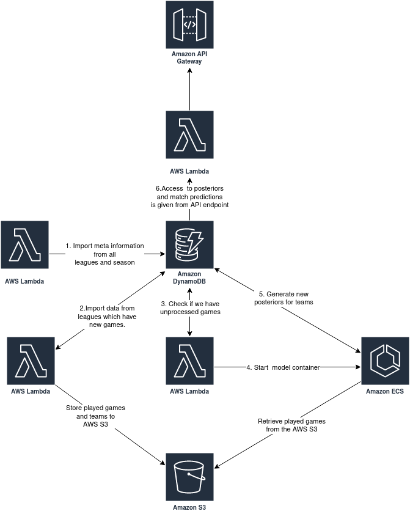

# BayesBall
The goal of BayesBall project is to make predictions and analytics from various soccer leagues around the world. Currently the model is running on around 500 different soccer leagues around the world. 
This is the cleaned up repository for the BayesBall project and note that all of components are not included in this public repository.

### Model:
The model is a Bayesian model implemented in using Pymc3 inspired by https://bayesbet.everettsprojects.com/.
#### Basic principles
- Each team has "offensive power" and "defensive power" but we are unsure what these are. Also the home team has inherent advantage against the away team and there is some constant value of goals that is scored on each game.
- More formally the goals are defined from the equation:
$$homeGoals \sim Poisson(exp(homeTeamOffensivePower - awayTeamDefensivePower + homeTeamAdvantage + constantGoalValue))$$
and
$$awayGoals \sim Poisson(exp(awayTeamOffensivePower - homeTeamDefensivePower + constantGoalValue))$$

- First we have some guess on what these values might be. Lets say for all teams the offensive and defensive value is normally distributed with mean of $0$ and standard deviation of $1$. Same with the home team advantage and constant goal value.
- We calculate the posterior distribution for each team. For example let's say we had a game where FC Bayern Munich was playing against Borussia Dortmund and the game ended 3-0 for the FC Bayern Munich. Using this information the model updates the prior values.
- We might conclude that:
	- FC Bayern Munich had better offensive / defensive power.
	- Borussia Dortmund had worse offensive / defensive power.
	- Home team had advantage.
	- The constant value for goals is above $0$.
- Example of team posteriors after the example match:
	- FC Bayern Munich has offensive power with mean on $0.2$ and standard deviation of $0.8$.
	- Borussia Dortmund has defensive power with mean on $-0.1$ and standard deviation of $0.8$.
	- Home team advantage is $0.6$ with a standard deviation of $0.7$.
		- This means that home teams are likely to score ~ $1.8$ (95% confidence intervals: ($0.12$, $7.94$)) goals more than the away team.
- When we receive data from the next day we use the posteriors from the previous day as our priors, except we add a bit of uncertainty to those estimates.

### Components and infrastructure:


1. AWS Lambda function running weekly to fetch new meta information.
	1. Included information: League id, season, season end, season start, other meta such as team logo, home town etc.
	2. This the route where new seasons or leagues get to our system.
2. AWS Lambda function which runs periodically to fetch new played games and team changes to our database.
		1. Checks the leagues with active seasons, sorts them by the date when we have last time fetched the information. If the league has new games that we have not processed (our latest posterior is from an earlier date) we set the posteriors_need_to_update value in AWS DynamoDB as true so the next lambda function knows that we need to update the posteriors.
Components which are **not included** in this repository:
3. AWS Lambda function running periodically to check if we have some leagues which do not have posteriors up to date.
	1. If we find any posteriors that need updating we spin up Docker containers using the AWS ECS which calculates and stores the new posteriors to the AWS DynamoDB.
4. Docker container which calculates the new posteriors runs in the AWS ECS.
	1. The played games are fetched from the AWS S3 and old posteriors are fetched from AWS DynamoDB.
5. The all the new posteriors are inserted to the AWS DynamoDB.
6. Access to front-end application / analytics etc. is given through API-endpoint which can return either posteriors or predictions.

### Building and deploying the application stack
1. Rename samconfig-example.toml -> samconfig.toml and fill your rapid-api-key to where it is asked.
2. Build and deploy the application stack by running:
```bash
sam build
sam deploy --config-env=<dev/prod>
# or
make build-and-deploy-<dev/prod>
```

### Decisions and what to do differently.
- "Standard" vs. serverless solution.
	- This is running on serverless stack just for trying this out and not having to pay for servers running constantly. The stack was previously running on Heroku using Airflow and PostgreSQL before this setup and before that this was running locally using few large scripts and SQLite. After the Heroku went paid I migrated the stack to AWS (and I wanted to try AWS native services).
	- The solution with relational database was much better as it's much easier to work with relational database compared to DynamoDB and having datapipe error logging in the Airflow was much cleaner compared to checking logs from multiple serverless functions.
- The solution is tightly integrated to current database.
	- It is faster to prototype when you integrate tightly to one database but changing the stack is big workload as you have to refactor quite a big portion of your codebase. The better solution is to write code around interfaces and this one major thing I would like to change (and change back to relational database).
##### How much does this cost?
Database and import lambdas cost around 10 cents a month. You can stay under the free limits of the Rapid API so you don't have to pay for API tokens.

### TODO:
1. Get the rapid-api-key from the secretsmanager instead of hardcoding it to samconfig.
2. Move the other components from private repository to this one.
3. Unit testing.
4. Clean front-end or provide API-keys to other users.
